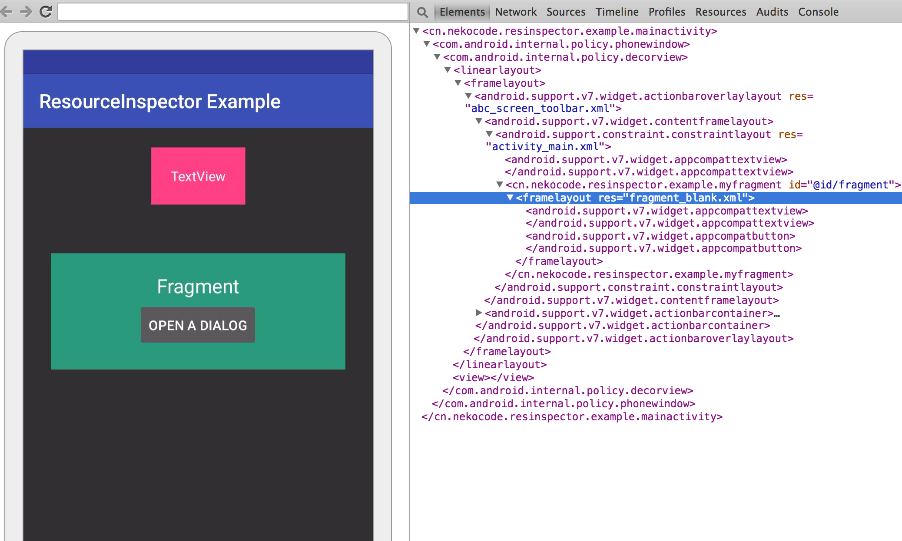

# README
[](http://www.apache.org/licenses/LICENSE-2.0.html) [](https://jitpack.io/#nekocode/ResourceInspector)

A debug tool to inspect used layout files of current Activity. This tool is helpful when you want to find out layout xml files used in current Activity from a large amount of resource files.

This tool depenends on the **[Stetho](http://facebook.github.io/stetho/)** library. After you integrate this library to your project, you can open the Chrome's [DevTools window](https://developer.chrome.com/devtools#devtools-window) (navigate to `chrome://inspect` for opening it) to inspect your current Activity.



You can click the  icon in the DevTools window to switch your Application to the search model. And then you can click on the widget you want to search in your Activity to quickly locate the corresponding element in the DevTools window.

## Getting started

In your `build.gradle`:

```gradle
repositories {
    maven { url "https://jitpack.io" }
}
dependencies {
    debugCompile "com.github.nekocode.ResourceInspector:resinspector:${lastest-version}"
    releaseCompile "com.github.nekocode.ResourceInspector:resinspector-no-op:${lastest-version}"
    testCompile "com.github.nekocode.ResourceInspector:resinspector-no-op:${lastest-version}"

    compile "com.facebook.stetho:stetho:${stetho-lastest-version}"
}
```

In your `Application` class:

```java
public class MyApplication extends Application {
    @Override
    public void onCreate() {
        super.onCreate();
        ResourceInspector.initialize(this);
    }
}
```

In your (Base) `Activity` class:

```java
public class BaseActivity extends Activity {
    @Override
    protected void attachBaseContext(Context newBase) {
        super.attachBaseContext(ResourceInspector.wrap(newBase));
    }
}
```
